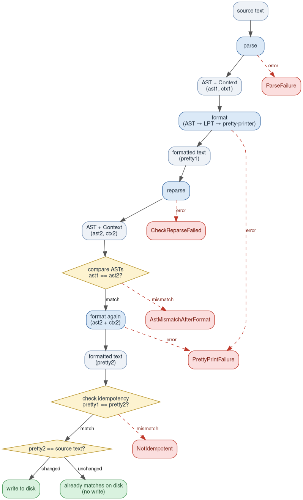
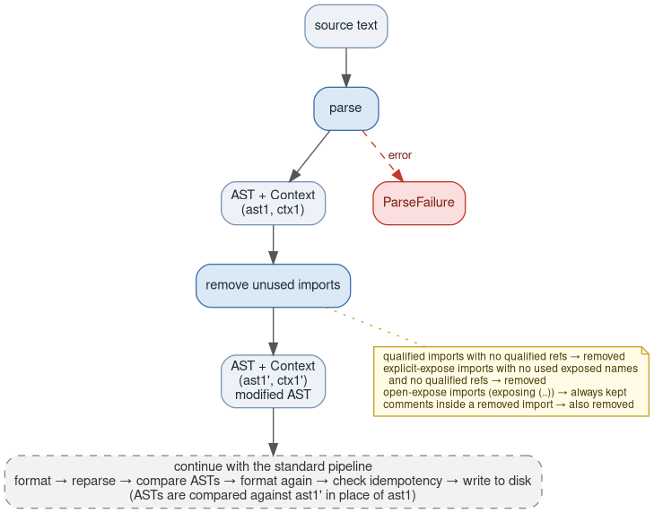

# gren-format

`gren-format` is a code formatter for the [Gren](https://gren-lang.org)
programming language. It rewrites Gren source files into one canonical style, so
code looks the same no matter who wrote it, except that the formatter also
honors the author's choice of line breaks. The formtting helps diffs stay focused on real
changes. Run it with no arguments to reformat every source file in your project
in place, or point it at individual files.

Formatting is **safe by construction**: before writing anything to disk, the tool
reparses its own output and verifies that the abstract syntax tree is unchanged
(so a reformat never alters what your program *means*) and that formatting is
idempotent (so an already-formatted file is left byte-for-byte untouched). If
either check ever fails, it reports a bug to the user instead of overwriting the file.
See [Formatting pipeline](#formatting-pipeline) below for the full sequence.

## Usage

```
gren-format [flags] [file ...]
```

Format every source file in the project (needs a `gren.json` in the current
directory or a parent):

```
gren-format
```

Format specific files or directories in place:

```
gren-format src/Main.gren src/Util.gren
```

Preview formatted output without writing:

```
gren-format --show src/Main.gren
```

Remove unused imports while formatting:

```
gren-format --remove-unused-imports
gren-format --remove-unused-imports src/Main.gren
gren-format --remove-unused-imports --show src/Main.gren
```

## Formatting pipeline

Every file goes through a format-and-verify pipeline before anything is
written to disk. The pipeline runs two full format passes and checks the
result at each stage to ensure correctness.

### Standard pipeline



The reparse + AST comparison step ensures the formatter never silently
changes the meaning of a program. The idempotency check ensures that
formatting twice produces the same result as formatting once — so a
file that has already been formatted is left unchanged on future runs.

### Pipeline with `--remove-unused-imports`

When `--remove-unused-imports` is passed, an AST transformation step is
inserted between parsing and the first format pass. The rest of the
pipeline is identical, but all comparisons are made against the
transformed AST rather than the original.



## Unused import analysis

The `--remove-unused-imports` pass scans the module body for three kinds
of reference:

- **Qualified references** — `Dict.get`, `Maybe.Just`, `List.Extra.member`.
  These carry the module name (or alias) directly in the AST node, so
  detection is exact.

- **Unqualified references** — bare names like `toUpper`, `Just`, `member`
  that come from an `exposing (...)` clause. These are detected
  conservatively: if the name appears anywhere in the module (even if
  shadowed by a local definition), the import is kept.

- **Operator references** — `+`, `|>`, `==`, etc., whether used inline
  (`a + b`) or as a value (`(+)`). These are matched against
  `ExposedOperator` entries in the expose list.

Open-expose imports (`exposing (..)`) are always kept because the pass
cannot know which names the imported module exports without resolving
the full module graph. An exposed `Type(..)` is kept for the same reason:
it brings the type's constructors into scope unqualified, and a bare
constructor name elsewhere in the file can't be attributed to this import
versus another module's same-named constructor.

A *kept* import still has its exposing list trimmed name by name: any
exposed name that itself fails the "used anywhere" check is dropped even
though the import survives — `import Dict exposing (get, insert)` becomes
`import Dict exposing (get)` when only `get` is referenced.

When an import is removed, any comments whose start line falls within
that import's source line range are removed with it. Comments elsewhere
(between imports, before or after the import block) are preserved. A
comment on its own line directly above a removed import is left in place
and the import is replaced by a `-- removed import Foo` placeholder, so
the comment is never silently reattached to whatever moves up into the
gap.

Assuming `Array` goes unused in each example below:

| Before | After |
|---|---|
| `import Dict`<br>`import Array -- unused, but noted here` | `import Dict` |
| `import Dict`<br>`-- Array is used for buffering`<br>`import Array` | `import Dict`<br>`-- Array is used for buffering`<br>`-- removed import Array` |
| `-- Module imports below`<br>`import Dict`<br>`import Array` | `-- Module imports below`<br>`import Dict` |

## Debug flags

These flags operate on a single file and write to stdout instead of disk:

| Flag | Effect |
|---|---|
| `--show <file>` | Format and print result |
| `--pre-ast <file>` | Print parsed AST as JSON |
| `--pre-context <file>` | Print parsed parse Context (comments) as JSON |
| `--post-ast <file>` | Format, verify ASTs match, print formatted AST as JSON |
| `--lpt <file>` | Print Logical Printing Tree as JSON |
| `--box <file>` | Print the `Box` render tree as a JSON |

`--show` respects `--remove-unused-imports`. The other debug flags operate
on the raw AST and do not.

## Getting help / reporting bugs

Found a bug, or have formatting output that looks wrong? Open an issue at
[github.com/gilramir/gren-format/issues](https://github.com/gilramir/gren-format/issues).

[Discord](https://discord.gg/Chb9YB9Vmh) is the official meeting place for
people who are curious about Gren. The core team posts development updates
there at regular intervals, and there are channels for people to ask
questions.

---

Gilbert Ramirez <gram@alumni.rice.edu>
